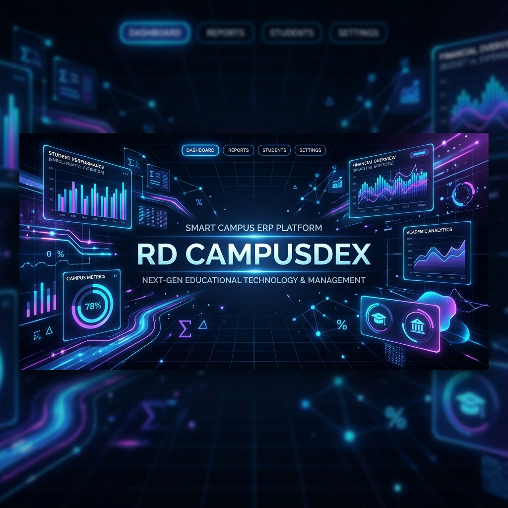
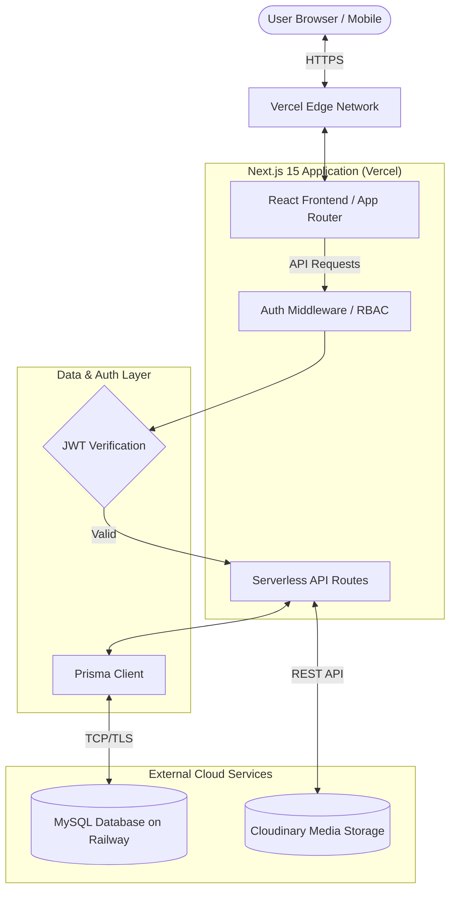
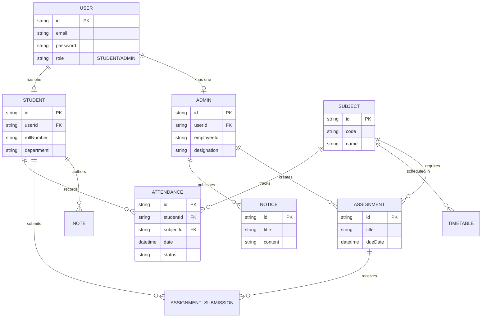

<div align="center">
  
  
# 🚀 RD CAMPUSDEX
### A Modern Smart Campus ERP Platform

[](https://nextjs.org/)
[](https://www.typescriptlang.org/)
[](https://www.prisma.io/)
[](https://www.mysql.com/)
[](https://tailwindcss.com/)
[](https://vercel.com)
[](LICENSE)

*A production-ready SaaS product redefining educational administration.*

</div>

---

## 🌐 Live Demo & Evaluator Access

**Live Website URL:** [https://rd-campusdex.vercel.app](https://rd-campusdex.vercel.app)  
**GitHub Repository:** [https://github.com/USERNAME/rd-campusdex](https://github.com/USERNAME/rd-campusdex) (Replace USERNAME)

### 🔑 Demo Credentials

To fully explore the platform's role-based access control and distinct dashboards, please use the following seeded credentials:

#### Administrator Portal
- **Email:** `admin@campusdex.com`
- **Password:** `Admin@123`

#### Student Portal
- **Email:** `student1@campusdex.com`
- **Password:** `Student@123`

---

## 📖 Project Overview

**RD CampusDex** is a comprehensive, cloud-native Enterprise Resource Planning (ERP) platform designed specifically for modern educational institutions. 

**The Problem:** Traditional campus management software is often bloated, slow, and non-intuitive, creating friction between students, faculty, and administration.
**The Solution:** A lightning-fast, highly responsive SaaS application that unifies attendance, timetabling, assignments, and campus communication into a single pane of glass.

Built with an uncompromising focus on developer experience (DX) and user experience (UX), CampusDex leverages a modern edge-ready architecture to deliver secure, real-time insights for all stakeholders.

---

## ✨ Features

### 🎓 Student Features
* **Interactive Dashboard:** Real-time overview of upcoming classes, pending assignments, and recent notices.
* **Attendance Tracking:** Visual breakdown of attendance percentages across all enrolled subjects.
* **Timetable:** Dynamic, responsive weekly schedule.
* **Assignments & Submissions:** Secure upload portal for coursework with deadline tracking.
* **Personal Notes:** A dedicated space for academic notes and reminders.
* **Campus Notices:** Institution-wide announcements pinned for visibility.
* **Profile Management:** Centralized personal and academic record tracking.

### 👑 Admin Features
* **Command Center Dashboard:** High-level analytics of campus operations.
* **Student Management:** Full CRUD operations on student records and enrollments.
* **Attendance Management:** Digital register for marking and modifying daily attendance.
* **Assignment Management:** Create, distribute, and grade assignments across batches.
* **Timetable Management:** Conflict-free scheduling engine.
* **Notice Management:** Broadcast announcements to specific departments or the entire campus.

---

## 📸 Screenshots

*(Replace placeholder image paths with actual raw GitHub URLs or local `/public` assets once uploaded)*

| Landing Page | Login Portal |
|:---:|:---:|
|  |  |

| Student Dashboard | Admin Dashboard |
|:---:|:---:|
|  |  |

---

## 🛠 Tech Stack

**Frontend:**
- **Framework:** Next.js 15 (App Router)
- **Library:** React 19
- **Language:** TypeScript
- **Styling:** TailwindCSS
- **Components:** Shadcn UI, Lucide Icons

**Backend:**
- **API:** Next.js API Routes (Serverless)
- **Authentication:** Custom JWT-based Auth with Bcrypt hashing
- **ORM:** Prisma

**Database & Cloud Infrastructure:**
- **Database:** MySQL (Hosted on Railway)
- **Deployment:** Vercel (Edge Network)
- **Storage:** Cloudinary (For future attachment handling)

---

## 🏗 Project Architecture



---

## 🗄 Database Schema (ER Diagram)



---

## 📂 Folder Structure

```text
rd-campusdex/
├── app/                  # Next.js App Router (Pages, Layouts, API Routes)
│   ├── (auth)/           # Authentication pages (Login, Register)
│   ├── admin/            # Admin dashboard and management routes
│   ├── api/              # Serverless API endpoints
│   └── student/          # Student portal routes
├── components/           # Reusable React components (UI, Layouts)
│   ├── ui/               # Base Shadcn UI components
│   └── shared/           # Shared domain components
├── lib/                  # Utilities, Prisma client singleton, Helpers
├── prisma/               # Database schema, migrations, and seed scripts
│   ├── schema.prisma     # Main database schema
│   └── seed.ts           # Demo data seeder
├── public/               # Static assets (images, icons)
├── .env.example          # Template environment variables
├── middleware.ts         # Edge middleware for RBAC routing
├── package.json          # Dependencies & Scripts
└── tailwind.config.ts    # Tailwind CSS configuration
```

---

## 🚀 Installation Guide

### Prerequisites
- Node.js (v18 or higher)
- npm or yarn
- MySQL instance (local or cloud)

### Steps

1. **Clone the repository:**
   ```bash
   git clone https://github.com/USERNAME/rd-campusdex.git
   cd rd-campusdex
   ```

2. **Install dependencies:**
   ```bash
   npm install
   ```

3. **Configure Environment Variables:**
   Copy the example environment file and update the variables.
   ```bash
   cp .env.example .env
   ```
   *(Ensure `DATABASE_URL` points to your MySQL database).*

4. **Initialize Database:**
   Push the schema to your database and generate the Prisma client.
   ```bash
   npx prisma db push
   npx prisma generate
   ```

5. **Seed the Database (Optional but recommended):**
   ```bash
   npx tsx prisma/seed.ts
   ```

6. **Start the Development Server:**
   ```bash
   npm run dev
   ```
   *Application will be live at `http://localhost:3000`*

---

## 🔒 Environment Variables

See `.env.example` for the full list. Key variables required for the app to function:

- `DATABASE_URL`: Your MySQL connection string.
- `JWT_SECRET`: A secure random string used to sign authentication tokens.
- `NEXT_PUBLIC_APP_URL`: Base URL for absolute linking.

---

## ☁️ Deployment Guide

### Deploying to Vercel
RD CampusDex is optimized for Vercel. 
1. Push your code to GitHub.
2. Import the repository into Vercel.
3. Add your Environment Variables (specifically `DATABASE_URL` and `JWT_SECRET`).
4. Vercel will automatically run `npm run build`. The build script in `package.json` includes `prisma generate` to ensure the ORM is compiled for the serverless functions.

### Database Hosting (Railway)
This project uses Railway for MySQL hosting. Ensure your `DATABASE_URL` is set to the production Railway connection string. Use `npx prisma migrate deploy` for applying schema changes in production.

---

## ⚡ Performance & Security Features

* **JWT-Based RBAC:** Stateless, highly scalable authentication using HttpOnly cookies to prevent XSS.
* **Server Components:** Extensive use of Next.js 15 React Server Components to reduce JavaScript bundle sizes shipped to the client.
* **Optimized Routing:** Edge middleware ensures unauthenticated users never reach protected layouts, reducing server load.
* **Connection Pooling:** Prisma client singleton implementation prevents database connection exhaustion in serverless environments.
* **Responsive Design:** Fluid Tailwind UI that scales beautifully from mobile to 4k desktop displays.

---

## 🛣 Future Improvements (Roadmap)

- [ ] **Push Notifications:** Web Push API integration for instant assignment and notice alerts.
- [ ] **Calendar Integration:** Sync timetable and assignment deadlines to Google Calendar/Outlook.
- [ ] **AI Assistant:** Integration with LLMs to help students summarize notes and generate study guides.
- [ ] **Real-time Chat:** WebSocket integration for direct student-faculty communication.
- [ ] **PDF Reports:** Automated generation and export of attendance and grade transcripts.

---

<div align="center">
  <i>Developed with ❤️ for the future of education.</i>
</div>
