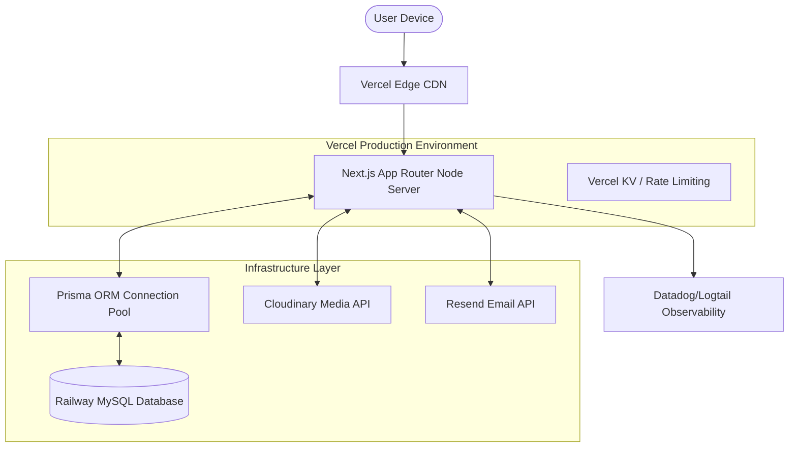
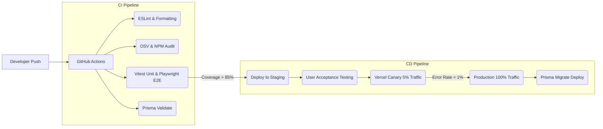
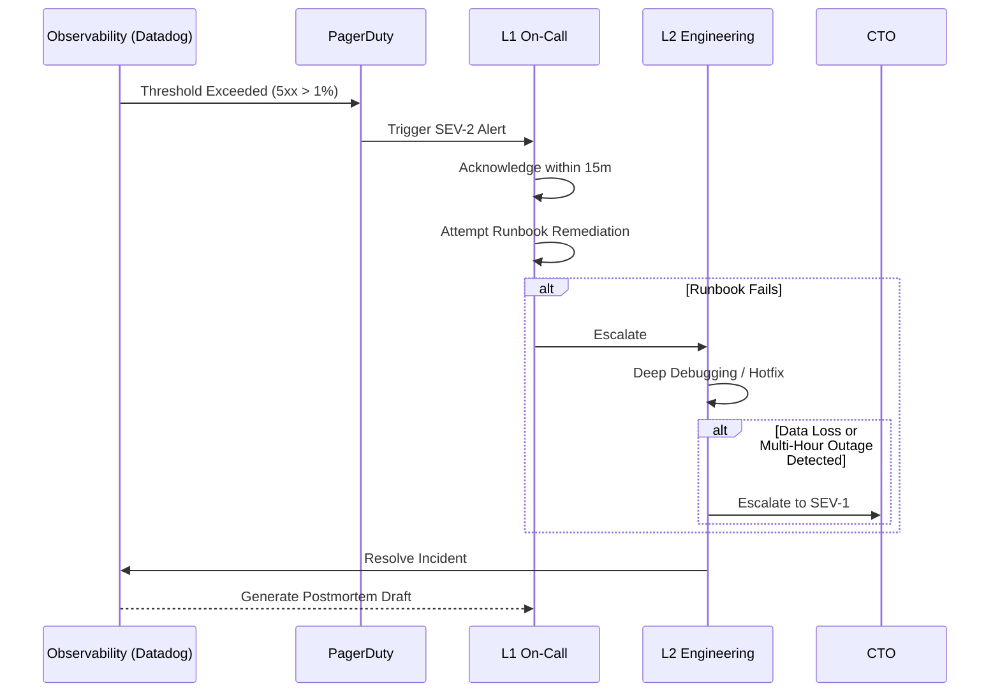

# RD CAMPUSDEX — Architecture Diagrams

## 1. Deployment Architecture

```mermaid
graph TD
    User([User Device]) --> CDN[Vercel Edge CDN]
    CDN --> NextJS[Next.js App Router Node Server]
    
    subgraph Vercel Production Environment
        NextJS
        KV[Vercel KV / Rate Limiting]
    end
    
    subgraph Infrastructure Layer
        NextJS <--> Prisma[Prisma ORM Connection Pool]
        Prisma <--> DB[(Railway MySQL Database)]
        NextJS <--> Cloudinary[Cloudinary Media API]
        NextJS <--> Resend[Resend Email API]
    end
    
    NextJS --> Logger[Datadog/Logtail Observability]
```

## 2. CI/CD & Migration Pipeline

```mermaid
graph LR
    Dev[Developer Push] --> GitHub[GitHub Actions]
    
    subgraph CI Pipeline
        GitHub --> Linting(ESLint & Formatting)
        GitHub --> Security(OSV & NPM Audit)
        GitHub --> Tests(Vitest Unit & Playwright E2E)
        GitHub --> DBValidate(Prisma Validate)
    end
    
    Tests -- "Coverage > 85%" --> DeployStage
    
    subgraph CD Pipeline
        DeployStage(Deploy to Staging) --> UAT(User Acceptance Testing)
        UAT --> ProdCanary(Vercel Canary 5% Traffic)
        ProdCanary -- "Error Rate < 1%" --> ProdFull(Production 100% Traffic)
        ProdFull --> Migration(Prisma Migrate Deploy)
    end
```

## 3. Incident Escalation Workflow

```mermaid
sequenceDiagram
    participant System as Observability (Datadog)
    participant PagerDuty
    participant L1 as L1 On-Call
    participant L2 as L2 Engineering
    participant CTO
    
    System->>PagerDuty: Threshold Exceeded (5xx > 1%)
    PagerDuty->>L1: Trigger SEV-2 Alert
    L1->>L1: Acknowledge within 15m
    L1->>L1: Attempt Runbook Remediation
    
    alt Runbook Fails
        L1->>L2: Escalate
        L2->>L2: Deep Debugging / Hotfix
        
        alt Data Loss or Multi-Hour Outage Detected
            L2->>CTO: Escalate to SEV-1
        end
    end
    
    L2->>System: Resolve Incident
    System-->>L1: Generate Postmortem Draft
```
